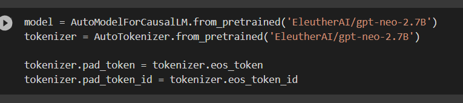
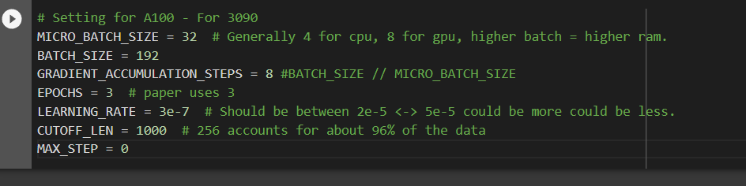

License:
cc-by-nc-4.0, Attribution-NonCommercial 4.0 International (CC BY-NC 4.0)
https://creativecommons.org/licenses/by-nc/4.0/

For training on local gpus: https://github.com/Dampish0/ModelTrainingLocal

HELLO, HERE IS THE CODE FOR TRAINING ON COLAB.
https://colab.research.google.com/drive/18J71X7pgU7H3ZpctvthZkGj1dJ70BnXI?usp=sharing

Here is training data, 2 DATASET DONT GET THEM CONFUSED!!
https://huggingface.co/datasets/Dampish/QuickTrain/tree/main

If you use my code, give credit.

So ill make it short
You can change dataset here

Data is the actual training data
valid_data is the validation data
u change model here

u choose anything on huggingface.co
and replace eleutherai/gpt-neo-2.7B
make sure to not pick something too heavy
because the free compute is only 15gb vram
13gb cpu ram
2.7b neo is not runnable on free tier
here u change training parameters

the only parameters u need to worry about are gradient_accumulation_steps
and learning rate
epoch is basically for how long you want to train it
its easier to limit training with max step than using epoch
cutoff _len is not important, it only changes how long the instruction is before it cuts it off
some models have a max limit of 1024 tokens
